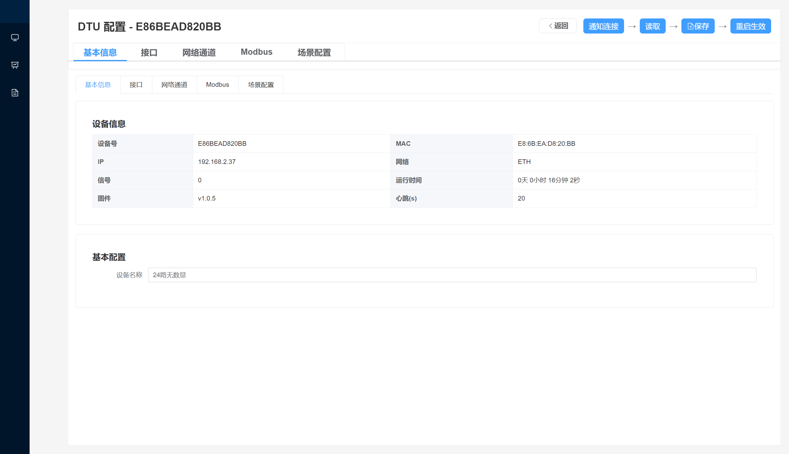
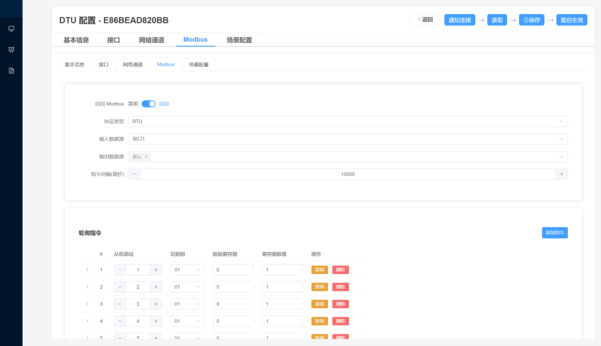
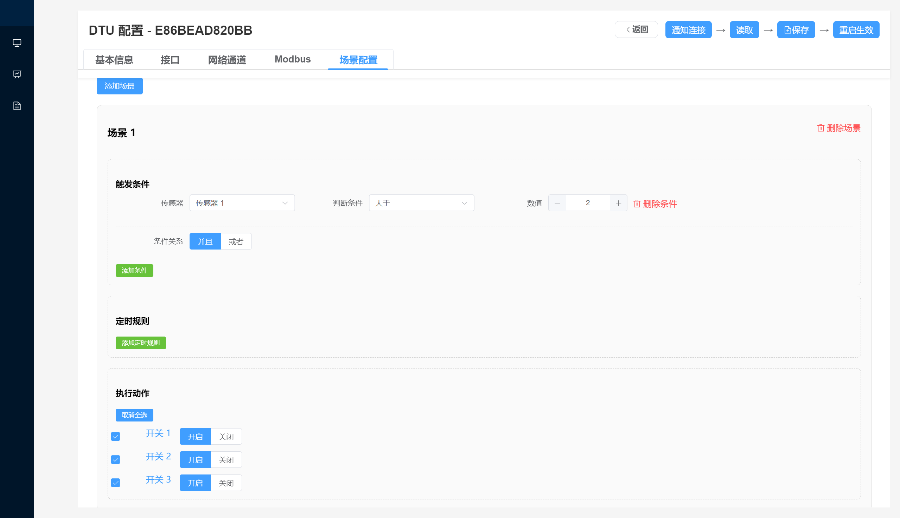

### 🛠 配置软件项目介绍

&emsp;本项目旨在为物联网设备提供一套 跨平台、可扩展、易维护 的配置管理工具，帮助用户快速完成设备的初始化部署、参数配置、状态监控与固件升级。软件作为设备与用户之间的桥梁，实现即插即用的接入体验，适用于 Modbus、MQTT、485、以太网等多种工业场景。

#### 🔧 项目核心功能

###### 设备自动发现（局域网广播）
&emsp;软件可自动搜索局域网中的设备，实现零配置接入，无需手动输入 IP。

###### Modbus 指令动态配置
&emsp;支持任意从站地址、寄存器、功能码的组合，适配各种传感器与执行器。
配置可即时下发到设备端，无需重启。

###### 串口参数可视化配置
图形化界面配置波特率、校验位、停止位、数据位等，实时生效。

###### 网络通道配置管理
&emsp;一键配置 WiFi / Ethernet / MQTT 服务器参数，支持静态 IP 与 DHCP 切换。

###### 局域网固件升级（LAN OTA）
&emsp;软件内置局域网文件服务器，可对多个设备进行高效稳定的批量升级。

###### 终端运行状态监控
&emsp;实时展示设备 CPU 使用率、内存占用、网络状态、Modbus 数据和日志输出。

###### 🧩 技术特点

基于 Electron + Vue3 构建跨平台桌面应用（Win/Mac/Linux）。

使用 UDP 广播 + HTTP/MQTT 实现自动发现与设备通信。

配置采用 JSON Schema 结构化管理，支持导入导出与快速迁移。

内置日志控制台，方便用户和开发者排查问题。

支持批量任务执行，提升工程部署效率。

###### 🎯 项目价值

大幅降低设备部署门槛：无需工程师介入即可完成基础配置。

统一管理配置逻辑：保证设备端参数规范一致，减少错误率。

提高维护效率：提供状态监控和 OTA 升级，降低售后成本。

可扩展性强：适配多类型传感器、执行器和通信协议。









##### 🛠 环境与安装说明（Node 18）
1. 配置国内镜像（提升下载速度）
设置 npm/yarn 使用淘宝镜像
yarn config set registry https://registry.npmmirror.com

配置 Electron 国内镜像
set ELECTRON_MIRROR=https://npmmirror.com/mirrors/electron/
yarn config set ELECTRON_MIRROR https://npmmirror.com/mirrors/electron/

2. 安装 Electron 依赖
   ```
   npm install electron@29.4.6 --save-dev
   ```

3. 安装所有依赖
   ```
    yarn install
    ```

###### 📦 打包桌面程序
使用 electron-builder（推荐）
electron-builder --win --x64

如果在 PowerShell 中执行
npx electron-builder --win --x64


